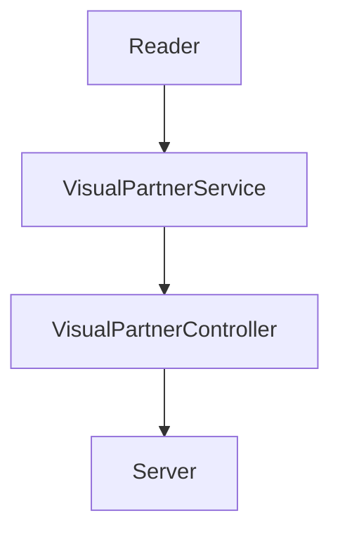
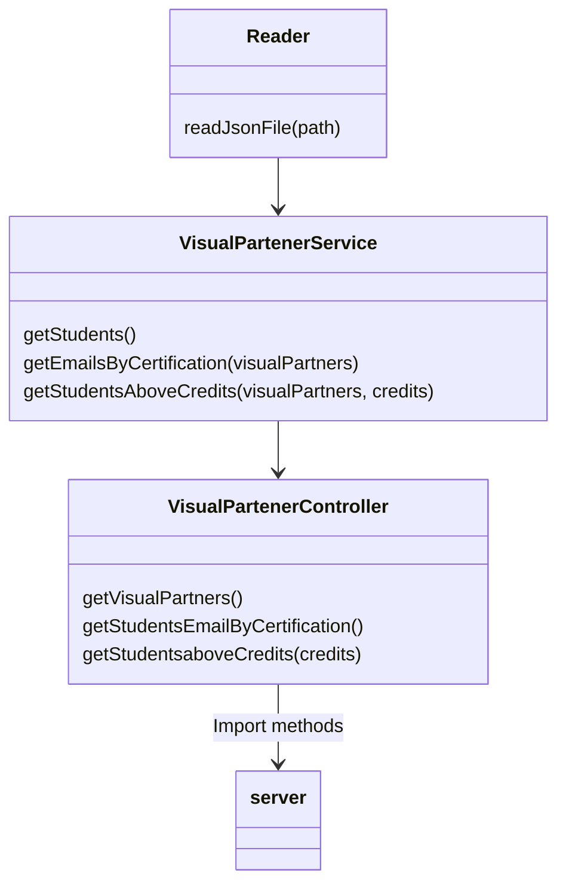

# Code-challenge-LaunchX
New project by LaunchX API design and applying testing and server with Express
Requerimientos:

1) Habilitar un endpoint para consultar todos los estudiantes con todos sus campos.
2) Habilitar un endpoint para consultar los emails de todos los estudiantes que tengan certificación haveCertification.
3) Habilitar un endpoint para consultar todos los estudiantes que tengan credits mayor a 500.

| Endpoint | Request | Response |
|---|---|---|
| `localhost:3000/v1/students/` | `localhost:3000/v1/students` |  |
| `localhost:3000/v1/partners/emails/` | `localhost:3000/v1/partners/emails/` |  |
| `localhost:3000/v1/partners/:credits` | `localhost:3000/v1/partners/500` |  |

# System design

# Class Design

# Dependencies
- [Jest](https://jestjs.io/docs/api)
- [Express](https://expressjs.com/es/)
- [Eslint](https://eslint.org/)
